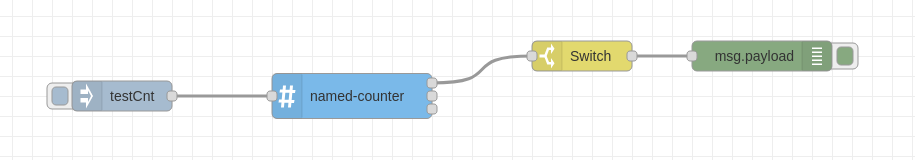

# NodeRED Named Counter



This is a counter node with multiple counters which you can count up and down separately.

## Install

Run the following command in your Node-RED user directory - typically `~/.node-red`

```
npm install node-red-contrib-named-counter
```

## Usage

Adds one to the counter named in the message payload. Configure the named counters in the node's properties.
There is one standard counter added on creation, which you can alrady use.

The node has three outputs:

### Standard output

Outputs the original payload and additionaly the counter object from the properties with the current counter value for the counter in the payload.

### Counter value max error

If the counter in the payload exceeds the configured mayValue, then this output is selected instead. Outputs the original payload to identify the selected counter.

### Counter not found error

If the counter is not found this output is selected. Outputs the original payload to identify the selected counter.

## License
This project is licensed unter the GNU GENERAL PUBLIC LICENSE Version 3.